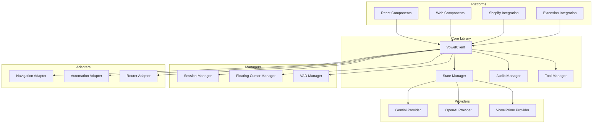
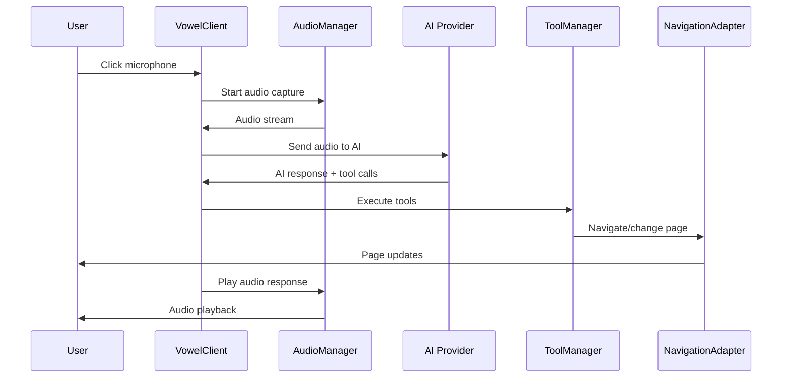
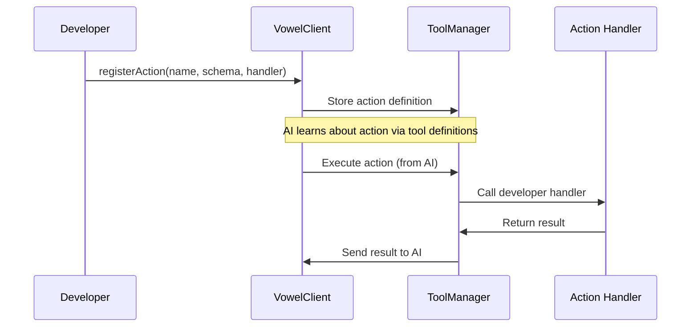
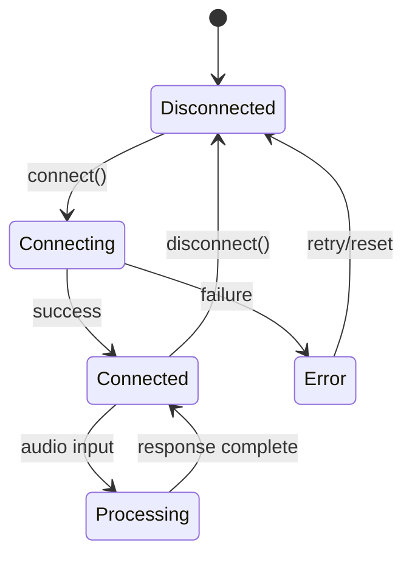

# Client Code Map

**Version:** 0.1.2
**Last Updated:** November 13, 2025
**Component:** client - @vowel.to/client Library

---

## Overview

The client component is the core voice agent integration library that developers install via NPM. It provides a framework-agnostic API for adding AI-powered voice interactions to any web application, supporting real-time conversation with navigation and automation capabilities.

**Purpose:** Framework-agnostic voice agent library for web application integration.

**Key Technologies:**
- **Core:** TypeScript 5.9, Web Audio API, WebSockets
- **AI Providers:** Google Gemini Live API, OpenAI Realtime API
- **Build:** Vite, Rollup (via Vite)
- **Platforms:** React, Web Components, Vanilla JS, Shopify, Extension

**Entry Points:**
- `lib/vowel/index.ts` - Main library exports
- `lib/vowel/core/VowelClient.ts` - Primary API class
- `platforms/generic/index.ts` - Framework adapters

---

## Architecture Overview

The client library follows a modular architecture with clear separation between core functionality and platform-specific integrations:



**Key Architectural Patterns:**
- **Manager Pattern:** Specialized managers handle audio, state, tools, sessions
- **Provider Pattern:** Abstract interface for different AI providers
- **Adapter Pattern:** Platform-specific integrations for navigation and automation
- **Observer Pattern:** Event-driven architecture for tool execution and notifications
- **Factory Pattern:** Dynamic provider and adapter instantiation

---

## Directory Structure

```
client/
├── lib/vowel/                   # Core library source
│   ├── core/                    # Main API classes
│   │   ├── VowelClient.ts       # Primary client class
│   │   └── action-notifier.ts   # Event notification system
│   │
│   ├── managers/                # Specialized managers
│   │   ├── AudioManager.ts      # Audio capture/playback
│   │   ├── StateManager.ts      # Voice session state
│   │   ├── ToolManager.ts       # Tool execution
│   │   ├── SessionManager.ts    # Session lifecycle
│   │   ├── VADManager.ts        # Voice activity detection
│   │   └── FloatingCursorManager.ts # Visual feedback
│   │
│   ├── providers/               # AI provider implementations
│   │   ├── GeminiRealtimeProvider.ts    # Google Gemini
│   │   ├── OpenAIRealtimeProvider.ts    # OpenAI
│   │   ├── VowelPrimeRealtimeProvider.ts # Internal provider
│   │   └── RealtimeProviderFactory.ts   # Provider instantiation
│   │
│   ├── adapters/                # Framework integrations
│   │   ├── navigation/          # Page navigation adapters
│   │   ├── automation/          # DOM automation adapters
│   │   └── tanstack.ts          # Router-specific adapters
│   │
│   ├── platforms/               # Platform-specific code
│   │   ├── generic/             # Generic web app integration
│   │   ├── extension/           # Browser extension integration
│   │   └── shopify/             # Shopify-specific features
│   │
│   ├── components/              # UI components
│   │   ├── VowelAgent.tsx       # Main voice agent component
│   │   ├── FloatingMicButton.tsx # Microphone interface
│   │   ├── ControlledBanner.tsx # Status banner
│   │   └── web-components/      # Web component wrappers
│   │
│   ├── ui/                      # UI utilities
│   │   ├── FloatingActionPill.tsx # Action button
│   │   └── border-glow.ts       # Visual effects
│   │
│   ├── types/                   # TypeScript definitions
│   ├── utils/                   # Utility functions
│   │   ├── historyFormatter.ts  # Conversation history formatting
│   │   └── audioUtils.ts        # Audio processing utilities
│   └── version.ts               # Version information
│
├── platforms/                   # Build-time platform exports
│   ├── generic.ts
│   ├── extension.ts
│   └── shopify.ts
│
├── dist/                        # Built outputs
│   ├── client/                  # Library bundles
│   └── standalone/              # CDN bundles
│
├── testing/                     # Test scenarios and harnesses
├── scripts/                     # Build and deployment scripts
└── *.ts                         # Build entry points
```

---

## Key Modules

### Core: VowelClient API

**Purpose:** Main entry point for voice agent integration.

**Location:** `lib/vowel/core/VowelClient.ts`

**Key Features:**
- Voice session management
- Custom action registration
- Framework adapter integration
- Event notification system
- Connection lifecycle handling
- Pause/resume session control
- Conversation state export/import
- Server-side VAD support

**Responsibilities:**
- Initialize voice sessions
- Manage WebSocket connections
- Route audio data to AI providers
- Execute tool calls from AI responses
- Provide developer-friendly API

---

### Managers: Specialized Functionality

**Purpose:** Handle specific aspects of voice agent functionality.

**Location:** `lib/vowel/managers/`

**Key Managers:**
- **AudioManager:** Audio capture, playback, and processing
- **StateManager:** Voice session state and transitions
- **ToolManager:** Custom action execution and validation
- **SessionManager:** Session lifecycle and persistence
- **VADManager:** Voice activity detection
- **FloatingCursorManager:** Visual feedback for AI actions

**Responsibilities:**
- Encapsulate complex functionality
- Provide clean interfaces to core client
- Handle platform-specific implementations
- Manage resources and cleanup

---

### Providers: AI Integration

**Purpose:** Abstract interface to different AI providers.

**Location:** `lib/vowel/providers/`

**Supported Providers:**
- **GeminiRealtimeProvider:** Google Gemini Live API integration
- **OpenAIRealtimeProvider:** OpenAI Realtime API integration
- **VowelPrimeRealtimeProvider:** Internal vowel provider

**Responsibilities:**
- Handle provider-specific authentication
- Manage WebSocket connections
- Convert between internal and provider formats
- Handle provider-specific error conditions

---

## Data Flow

### Primary Flow: Voice Interaction



**Steps:**
1. **Initialization:** User clicks microphone button
2. **Audio Capture:** AudioManager captures microphone input
3. **AI Processing:** Audio streamed to AI provider
4. **Response Handling:** AI returns text + tool calls
5. **Tool Execution:** ToolManager executes requested actions
6. **Page Updates:** Adapters update DOM/navigation
7. **Audio Response:** AudioManager plays AI response

---

### Secondary Flow: Custom Actions



---

## Key Classes/Functions

### VowelClient Class

**Location:** `lib/vowel/core/VowelClient.ts`

**Purpose:** Main API class for voice agent integration.

**Key Methods:**
- `connect()` - Establish voice connection
- `disconnect()` - Clean up connection
- `registerAction()` - Add custom business logic
- `setAdapters()` - Configure navigation/automation
- `on()` - Event listeners for AI responses

**Usage:**
```typescript
const vowel = new VowelClient(appId, config);
await vowel.connect();
vowel.registerAction('addToCart', { /* schema */ }, handler);
```

---

### AudioManager Class

**Location:** `lib/vowel/managers/AudioManager.ts`

**Purpose:** Handle audio capture, processing, and playback.

**Key Features:**
- Web Audio API integration
- AudioWorklet for low-latency processing
- Voice activity detection
- Audio format conversion

**Responsibilities:**
- Microphone permission handling
- Audio stream management
- Format conversion (Float32 → PCM16)
- Audio playback of AI responses

---

### ToolManager Class

**Location:** `lib/vowel/managers/ToolManager.ts`

**Purpose:** Execute AI-requested actions and return results.

**Key Methods:**
- `registerTool()` - Add tool definition
- `executeTool()` - Run tool with parameters
- `validateTool()` - Check tool permissions

**Supported Tool Types:**
- Navigation actions (page changes)
- DOM manipulation (clicks, typing)
- Custom business logic
- Data retrieval

---

## State Management

**Pattern:** Internal state management with event-driven updates

**State Managers:**
- **StateManager:** Voice session state (connecting, connected, error)
- **SessionManager:** Session persistence and recovery
- **AudioManager:** Audio processing state

**State Flow:**


---

## API/Interface

### Public API

**Main Client API:**
```typescript
interface VowelClient {
  connect(): Promise<void>;
  disconnect(): Promise<void>;
  registerAction(name: string, definition: VowelAction, handler: ActionHandler): void;
  setAdapters(adapters: AdapterConfig): void;
  on(event: string, handler: EventHandler): void;
}
```

**Framework Adapters:**
```typescript
// React/Next.js
const { navigationAdapter, automationAdapter } = createNextJSAdapters(router);

// Generic web app
const { navigationAdapter, automationAdapter } = createGenericAdapters();
```

---

### Internal API

**Provider Interface:**
```typescript
interface RealtimeProvider {
  connect(): Promise<void>;
  disconnect(): Promise<void>;
  sendAudio(audio: Int16Array): void;
  sendText(text: string): void;
  registerTool(name: string, schema: ToolSchema): void;
  onResponse(callback: ResponseCallback): void;
}
```

**Adapter Interfaces:**
```typescript
interface NavigationAdapter {
  navigate(path: string): Promise<void>;
  getCurrentPath(): string;
}

interface AutomationAdapter {
  clickElement(selector: string): Promise<void>;
  typeText(selector: string, text: string): Promise<void>;
}
```

---

## Dependencies

### External Dependencies

**Production:**
- None (standalone library)

**Peer Dependencies:**
- For React integration: `react`, `react-dom`
- For TanStack Router: `@tanstack/react-router`

**Development:**
- `@types/web` - Web API type definitions
- `@ricky0123/vad-web` - Voice activity detection
- `vite` - Build tooling

---

### Internal Dependencies

**Depends On:**
- Platform backend (for configuration and tokens)
- Voice engine (for AI processing)

**Depended On By:**
- Demo applications
- Browser extension
- Shopify integration

---

## Configuration

**Build Configuration:**
- `vite.config.ts` - Multi-format builds (ESM, CJS, IIFE)
- Multiple entry points for different integrations
- Standalone bundle for CDN deployment

**Runtime Configuration:**
```typescript
interface VowelClientConfig {
  appId: string;
  voice?: VoiceConfig;
  adapters?: AdapterConfig;
  debug?: boolean;
}
```

---

## Testing

**Test Location:** `testing/` and test harnesses

**Test Strategy:**
- Manual testing scenarios in `testing/`
- Browser automation for integration testing
- Audio processing validation
- Cross-browser compatibility testing

**Key Test Scenarios:**
- Voice connection establishment
- Audio capture and processing
- Tool execution and navigation
- Error handling and recovery

---

## Common Patterns

### Provider Factory Pattern

**Used For:** Dynamic AI provider instantiation

**Example Location:** `lib/vowel/providers/RealtimeProviderFactory.ts`

**How It Works:**
Factory selects appropriate provider based on configuration and availability.

---

### Adapter Composition Pattern

**Used For:** Combining navigation and automation capabilities

**Example Location:** `lib/vowel/adapters/`

**How It Works:**
Adapters composed together to provide complete integration surface.

---

### Event Notification Pattern

**Used For:** Communicating AI responses and tool execution

**Example Location:** `lib/vowel/core/action-notifier.ts`

**How It Works:**
Observer pattern for decoupling AI responses from application logic.

---

## Critical Paths

### Path 1: Voice Session Establishment

**Purpose:** Connect user to AI voice agent

**Flow:**
1. User clicks microphone button
2. Client requests configuration from platform
3. Platform returns encrypted token + tool definitions
4. Client establishes WebSocket to voice engine
5. Voice engine validates token and connects to AI
6. Session begins with audio streaming

**Key Files:**
- `lib/vowel/core/VowelClient.ts`
- `lib/vowel/managers/SessionManager.ts`
- Platform `convex/apps.ts`

---

### Path 2: Tool Execution Pipeline

**Purpose:** Execute AI-requested actions in user browser

**Flow:**
1. AI provider returns tool call in response
2. ToolManager validates tool permissions
3. ToolManager executes tool with provided parameters
4. Result returned to AI for continuation
5. UI updates reflect action completion

**Key Files:**
- `lib/vowel/managers/ToolManager.ts`
- `lib/vowel/adapters/automation/`
- `lib/vowel/adapters/navigation/`

---

## Extension Points

**Where to add new features:**

**New AI Providers:**
- Location: `lib/vowel/providers/`
- Pattern: Implement `RealtimeProvider` interface
- Example: See `GeminiRealtimeProvider.ts`

**New Framework Adapters:**
- Location: `lib/vowel/adapters/`
- Pattern: Create adapter factory functions
- Example: See `adapters/tanstack.ts`

**New UI Components:**
- Location: `lib/vowel/components/`
- Pattern: React components with proper TypeScript interfaces
- Example: See `VowelAgent.tsx`

---

## Performance Considerations

**Bottlenecks:**
- Audio processing latency (Web Audio API limits)
- WebSocket connection overhead
- DOM manipulation performance
- Memory usage for audio buffers

**Optimizations:**
- AudioWorklet for background processing
- Efficient audio buffer management
- Lazy loading of providers
- Debounced UI updates

---

## Security Considerations

**Security Patterns:**
- Encrypted tokens with short expiry
- Input validation for tool parameters
- CORS restrictions for API access
- Secure WebSocket connections

**Sensitive Areas:**
- Token validation and decryption
- Tool permission checking
- Audio data handling
- User session management

---

## Known Issues

**Issue 1: Audio Context Suspension**
- Description: Browser suspends audio context when tab inactive
- Workaround: Resume context on user interaction
- Tracking: Handled in AudioManager

**Issue 2: WebSocket Connection Limits**
- Description: Browser limits concurrent WebSocket connections
- Workaround: Connection pooling and reuse
- Tracking: Managed in provider classes

---

## Future Improvements

**Planned:**
- Advanced VAD with neural networks
- Multi-language voice recognition
- Real-time conversation transcription
- Voice agent personality customization

**Under Consideration:**
- Video input processing
- Multi-user voice sessions
- Advanced audio effects
- Voice activity visualization

---

## References

**Related Documentation:**
- `docs/architecture/` - Client integration patterns
- `testing/` - Test scenarios and examples
- Platform `docs/architecture/` - Backend integration

**Related Codemaps:**
- `platform/CODEMAP.md` - Admin dashboard structure
- `engine/CODEMAP.md` - Voice engine structure

**External Resources:**
- [Google Gemini Live API](https://ai.google.dev/gemini-api/docs/live)
- [OpenAI Realtime API](https://platform.openai.com/docs/guides/realtime)
- [Web Audio API](https://developer.mozilla.org/en-US/docs/Web/API/Web_Audio_API)

---

**Last Updated:** November 13, 2025
**Maintained By:** vowel Development Team

This codemap documents the client library architecture and integration patterns. For overall monorepo information, see the root `CODEMAP.md`.

